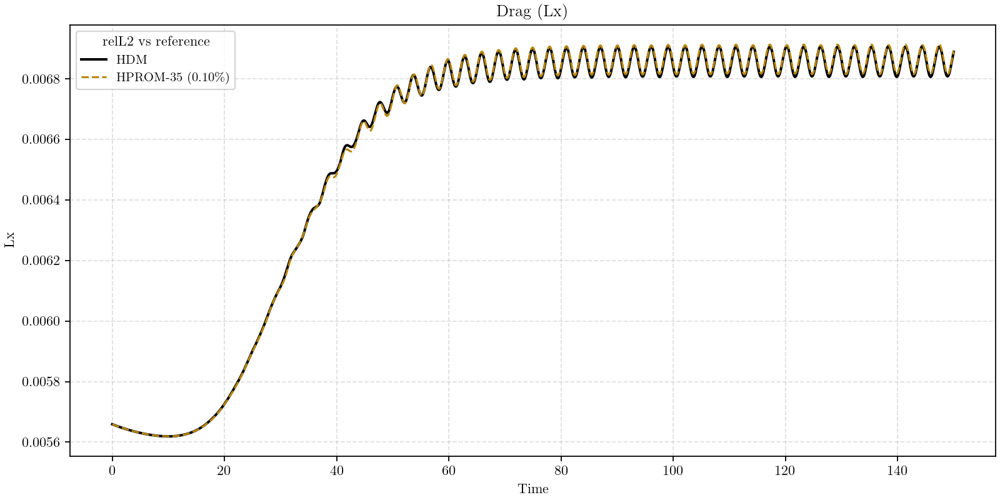
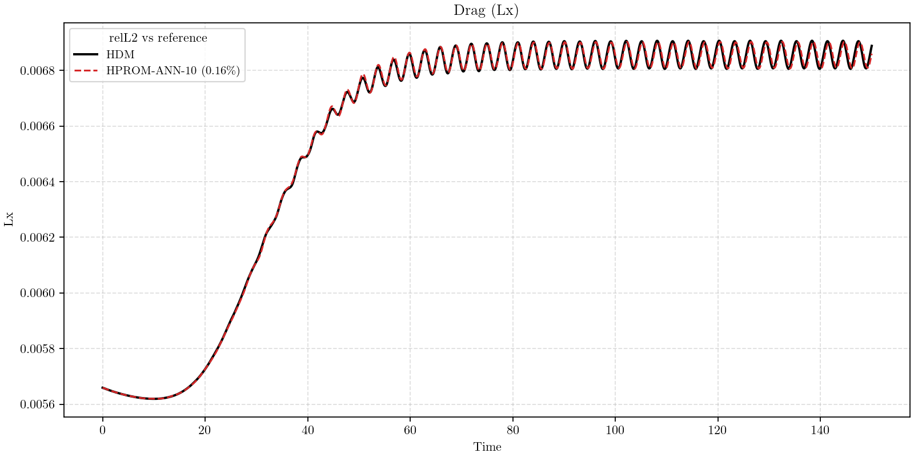
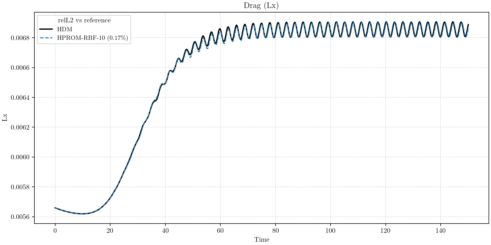
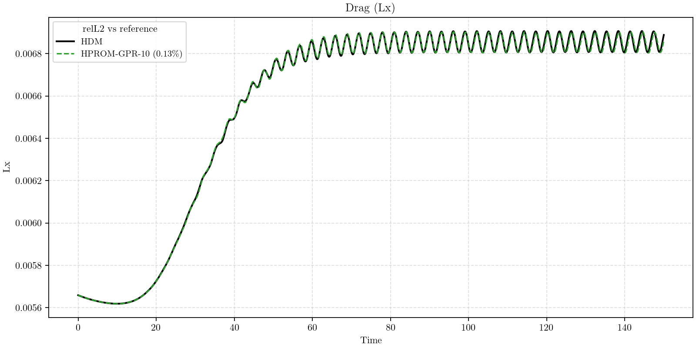
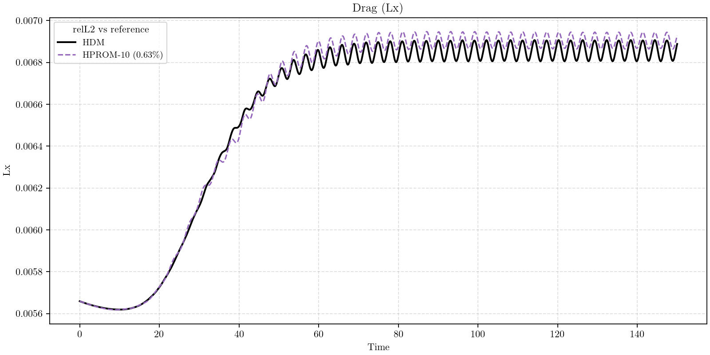

# AERO-F ROM Tutorial (Local)

This tutorial shows how to build and compare:
- **Linear projection-based ROMs**
- **Quadratic ROMs** (placeholder section)
- **Arbitrary nonlinear manifold projection-based ROMs** in AERO-F (ANN, RBF, GPR)

for 2D unsteady laminar viscous flow past a cylinder ($Re=100$).

## Contents
- [Overview](#overview)
- [Common Setup](#common-setup)
- [Linear PROM](#linear-prom)
- [Quadratic PROM](#quadratic-prom)
- [PROM-ANN](#prom-ann)
- [PROM-RBF](#prom-rbf)
- [PROM-GPR](#prom-gpr)
- [Optional: Lower-Bound Comparison (Linear PROM n=10)](#optional-lower-bound-comparison-linear-prom-n10)
- [Unified Plotting](#unified-plotting)
- [Machine-Learning Regression (Aero-F Notation)](#machine-learning-regression-aero-f-notation)
- [Manifold File Semantics](#manifold-file-semantics)
- [Trainer Notes (Tunable)](#trainer-notes-tunable)
- [ParaView (.exo)](#paraview-exo)
- [Troubleshooting](#troubleshooting)
- [Repository Note](#repository-note)

## Overview

Linear case:

$$
\mathbf{u}(t)\approx \mathbf{u}_{\mathrm{ref}}+\mathbf{V}\mathbf{q}(t)
$$

Quadratic case:

$$
\mathbf{u}(t)\approx \mathbf{u}_{\mathrm{ref}}+\mathbf{V}\mathbf{q}(t)
+\tfrac{1}{2}\mathbf{H}\bigl(\mathbf{q}(t)\otimes\mathbf{q}(t)\bigr)
$$

General manifold case:

$$
\bar{\mathbf{q}}=\mathcal{M}(\mathbf{q}),
\qquad
\mathbf{u}(t)\approx \mathbf{u}_{\mathrm{ref}}+\mathbf{V}\mathbf{q}(t)+\bar{\mathbf{V}}\bar{\mathbf{q}}(t)
$$

with:
- ANN: $\mathcal{M}=\mathcal{N}_{\theta}$
- RBF: $\mathcal{M}=\mathcal{R}_{\theta}$
- GPR: $\mathcal{M}=\mathcal{G}_{\theta}$

## Common Setup

Local defaults:
- `partnmesh`: `/home/kratos/aero-f_rom_turorial/partnmesh`
- `sower`: `/home/kratos/aero-f_rom_turorial/sower`
- `aerof`: `/home/kratos/aero-f/build_full/bin/aerof.opt`
- default local MPI size in scripts: `8` (override with `NP=16 ...` if desired)
- note: replace `/home/kratos/aero-f_rom_turorial` with your own local repository path.

Common data-generation steps (run once):

```bash
cd /home/kratos/aero-f_rom_turorial

# Mesh preprocessing
./clean_preprocess_outputs.sh
bash preprocess.sh

# Startup run
cd /home/kratos/aero-f_rom_turorial/simulations/run.fom.startup
./clean_startup_run_outputs.sh
bash run_startup.sh

# FOM snapshots
cd /home/kratos/aero-f_rom_turorial/simulations/run.fom
./clean_fom_run_outputs.sh
bash run_fom.sh
```

## Linear PROM

Reference linear workflow (default retained size in this branch):

```bash
# Offline POD
cd /home/kratos/aero-f_rom_turorial/simulations/run.offline.9999.01
./clean_offline_preprocessing_outputs.sh
bash run_pod.sh

# Online linear ROM
cd /home/kratos/aero-f_rom_turorial/simulations/run.rom.9999
./clean_rom_run_outputs.sh
bash run_rom.sh

# Hyper-reduction artifacts (ECSW)
cd /home/kratos/aero-f_rom_turorial/simulations/run.offline.9999.01
bash run_hyper.sh

# HROM preprocess
cd /home/kratos/aero-f_rom_turorial
bash preprocess.hrom.sh

# HROM online
cd /home/kratos/aero-f_rom_turorial/simulations/run.hrom.9999.01
./clean_hrom_run_outputs.sh
bash run_hrom.sh

# HROM postprocessing
cd /home/kratos/aero-f_rom_turorial/simulations/run.post_hrom.9999.01
./clean_post_hrom_run_outputs.sh
bash run_post_hrom.sh
```

Quick plot vs HDM for this section:

```bash
cd /home/kratos/aero-f_rom_turorial
python3 simulations/plot_compare_postpro.py \
  --tag hprom_35_vs_hdm \
  --reference HDM:simulations/run.fom/postpro \
  --model HPROM-35:simulations/run.post_hrom.9999.01/postpro
```




## Quadratic PROM

This section is intentionally left as a **placeholder** in this tutorial version.

When you are ready, we can add:
- exact offline generation steps,
- exact online run steps,
- dedicated comparison plots vs Linear/ANN/RBF/GPR.

## PROM-ANN

ANN branch (requires Torch-enabled AERO-F build):
- Trainer scripts are centralized in `simulations/trainers/`; no per-folder Python copy is required.

```bash
# Offline base for ANN
# Optional: skip run_pod_ann.sh if nonlinearrom/cluster0/state.coords already exists
# (for example, if this offline folder was already prepared/copied).
cd /home/kratos/aero-f_rom_turorial/simulations/run.offline_ann.9999.01
./clean_offline_preprocessing_outputs.sh
bash run_pod_ann.sh

# ANN trainer (builds s.coords from state.coords)
bash run_ann_trainer.sh

# ROM-ANN online
cd /home/kratos/aero-f_rom_turorial/simulations/run.rom_ann.9999
./clean_rom_ann_run_outputs.sh
bash run_rom_ann.sh

# ANN hyper artifacts
cd /home/kratos/aero-f_rom_turorial/simulations/run.offline_ann.9999.01
./clean_offline_ann_hyper_outputs.sh
bash run_hyper_ann.sh

# HROM-ANN preprocess
cd /home/kratos/aero-f_rom_turorial
./clean.hrom_ann.sh
bash preprocess.hrom_ann.sh

# HROM-ANN online + post
cd /home/kratos/aero-f_rom_turorial/simulations/run.hrom_ann.9999.01
./clean_hrom_ann_run_outputs.sh
bash run_hrom_ann.sh

cd /home/kratos/aero-f_rom_turorial/simulations/run.post_hrom_ann.9999.01
./clean_post_hrom_ann_run_outputs.sh
bash run_post_hrom_ann.sh
```

Quick plot vs HDM for this section:

```bash
cd /home/kratos/aero-f_rom_turorial
python3 simulations/plot_compare_postpro.py \
  --tag hprom_ann_10_vs_hdm \
  --reference HDM:simulations/run.fom/postpro \
  --model HPROM-ANN-10:simulations/run.post_hrom_ann.9999.01/postpro
```




## PROM-RBF

RBF branch (reuses baseline offline POD data):
- Trainer scripts are centralized in `simulations/trainers/`; wrappers load them automatically.
- This workflow is configured for a fixed primary size `p=10` (`s=25` for this case).

```bash
# Ensure baseline POD exists
# Optional: skip run_pod.sh if run.offline.9999.01 already has nonlinearrom/ and references/DEFAULT.PKG
cd /home/kratos/aero-f_rom_turorial/simulations/run.offline.9999.01
bash run_pod.sh

# Prepare RBF offline folder and train
cd /home/kratos/aero-f_rom_turorial/simulations/run.offline_rbf.9999.01
bash prepare_from_pod_base_rbf.sh
bash run_rbf_trainer.sh
bash run_hyper_rbf.sh

# HROM-RBF preprocess
cd /home/kratos/aero-f_rom_turorial
./clean.hrom_rbf.sh
bash preprocess.hrom_rbf.sh

# ROM-RBF
cd /home/kratos/aero-f_rom_turorial/simulations/run.rom_rbf.9999
./clean_rom_rbf_run_outputs.sh
bash run_rom_rbf.sh

# HROM-RBF + post
cd /home/kratos/aero-f_rom_turorial/simulations/run.hrom_rbf.9999.01
./clean_hrom_rbf_run_outputs.sh
bash run_hrom_rbf.sh

cd /home/kratos/aero-f_rom_turorial/simulations/run.post_hrom_rbf.9999.01
./clean_post_hrom_rbf_run_outputs.sh
bash run_post_hrom_rbf.sh
```

Quick plot vs HDM for this section:

```bash
cd /home/kratos/aero-f_rom_turorial
python3 simulations/plot_compare_postpro.py \
  --tag hprom_rbf_10_vs_hdm \
  --reference HDM:simulations/run.fom/postpro \
  --model HPROM-RBF-10:simulations/run.post_hrom_rbf.9999.01/postpro
```




## PROM-GPR

GPR branch (reuses baseline offline POD data):
- Trainer scripts are centralized in `simulations/trainers/`; wrappers load them automatically.

```bash
# Ensure baseline POD exists
# Optional: skip run_pod.sh if run.offline.9999.01 already has nonlinearrom/ and references/DEFAULT.PKG
cd /home/kratos/aero-f_rom_turorial/simulations/run.offline.9999.01
bash run_pod.sh

# Prepare GPR offline folder and train
cd /home/kratos/aero-f_rom_turorial/simulations/run.offline_gp.9999.01
bash prepare_from_pod_base_gp.sh
bash run_gp_trainer.sh
bash run_hyper_gp.sh

# HROM-GPR preprocess
cd /home/kratos/aero-f_rom_turorial
./clean.hrom_gp.sh
bash preprocess.hrom_gp.sh

# ROM-GPR
cd /home/kratos/aero-f_rom_turorial/simulations/run.rom_gp.9999
./clean_rom_gp_run_outputs.sh
bash run_rom_gp.sh

# HROM-GPR + post
cd /home/kratos/aero-f_rom_turorial/simulations/run.hrom_gp.9999.01
./clean_hrom_gp_run_outputs.sh
bash run_hrom_gp.sh

cd /home/kratos/aero-f_rom_turorial/simulations/run.post_hrom_gp.9999.01
./clean_post_hrom_gp_run_outputs.sh
bash run_post_hrom_gp.sh
```

Quick plot vs HDM for this section:

```bash
cd /home/kratos/aero-f_rom_turorial
python3 simulations/plot_compare_postpro.py \
  --tag hprom_gpr_10_vs_hdm \
  --reference HDM:simulations/run.fom/postpro \
  --model HPROM-GPR-10:simulations/run.post_hrom_gp.9999.01/postpro
```




## Optional: Lower-Bound Comparison (Linear PROM n=10)

Optional section: use this branch as a lower-bound linear comparator against ANN/RBF/GPR.

```bash
# Offline POD/hyper data for n=10
cd /home/kratos/aero-f_rom_turorial/simulations/run.offline.9999_10.01
./clean_offline_preprocessing_outputs.sh
bash run_pod.sh
bash run_hyper.sh

# HROM mesh preprocessing for n=10
cd /home/kratos/aero-f_rom_turorial
./clean.hrom_10.sh
bash preprocess.hrom_10.sh

# PROM-10 online
cd /home/kratos/aero-f_rom_turorial/simulations/run.rom.9999_10
./clean_rom_run_outputs.sh
bash run_rom.sh

# HROM-10 online
cd /home/kratos/aero-f_rom_turorial/simulations/run.hrom.9999_10.01
./clean_hrom_run_outputs.sh
bash run_hrom.sh

# HROM-10 postprocessing
cd /home/kratos/aero-f_rom_turorial/simulations/run.post_hrom.9999_10.01
./clean_post_hrom_run_outputs.sh
bash run_post_hrom.sh
```

Quick plot vs HDM for this section:

```bash
cd /home/kratos/aero-f_rom_turorial
python3 simulations/plot_compare_postpro.py \
  --tag hprom_10_vs_hdm \
  --reference HDM:simulations/run.fom/postpro \
  --model HPROM-10:simulations/run.post_hrom.9999_10.01/postpro
```




## Unified Plotting

Use one script only:
- `simulations/plot_compare_postpro.py`

Default consistent colors in plots:
- `PROM/HPROM-ANN`: red
- `PROM/HPROM-RBF`: blue
- `PROM/HPROM-GPR`: green
- `PROM/HPROM-35` (linear baseline): dark yellow (`darkgoldenrod`)
- `PROM/HPROM-10` (linear lower bound): purple
- `QPROM` / quadratic labels: magenta

Baseline (linear reference):

```bash
cd /home/kratos/aero-f_rom_turorial
python3 simulations/plot_compare_postpro.py \
  --tag baseline \
  --model ROM:simulations/run.rom.9999/postpro \
  --model HROM:simulations/run.post_hrom.9999.01/postpro
```

HROM-family comparison with HDM reference:

```bash
cd /home/kratos/aero-f_rom_turorial
python3 simulations/plot_compare_postpro.py \
  --tag hprom_only \
  --reference HDM:simulations/run.fom/postpro \
  --model HPROM-35:simulations/run.post_hrom.9999.01/postpro \
  --model HPROM-10:simulations/run.post_hrom.9999_10.01/postpro \
  --model HPROM-ANN-10:simulations/run.post_hrom_ann.9999.01/postpro \
  --model HPROM-RBF-10:simulations/run.post_hrom_rbf.9999.01/postpro \
  --model HPROM-GPR-10:simulations/run.post_hrom_gp.9999.01/postpro
```

ROM-family comparison with HDM reference:

```bash
cd /home/kratos/aero-f_rom_turorial
python3 simulations/plot_compare_postpro.py \
  --tag prom_only \
  --reference HDM:simulations/run.fom/postpro \
  --model PROM-35:simulations/run.rom.9999/postpro \
  --model PROM-10:simulations/run.rom.9999_10/postpro \
  --model PROM-ANN-10:simulations/run.rom_ann.9999/postpro \
  --model PROM-RBF-10:simulations/run.rom_rbf.9999/postpro \
  --model PROM-GPR-10:simulations/run.rom_gp.9999/postpro
```

All outputs are written in `simulations/postpro_compare/` as:
- 5 PNG files: `<tag>_<signal>.png`
- 5 PDF files: `<tag>_<signal>.pdf`
- 1 CSV summary: `<tag>_error_summary.csv`

## Machine-Learning Regression (Aero-F Notation)

This section summarizes the ANN/GPR/RBF manifold map used in this repository with consistent notation.

### Snapshot coordinates and training pairs

Given snapshot states $\{\mathbf{u}^s\}_{s=1}^{N_s}$ and reference state $\mathbf{u}_{\mathrm{ref}}$, define

$$
\mathbf{q}^s = \mathbf{V}^T(\mathbf{u}^s-\mathbf{u}_{\mathrm{ref}}),\qquad
\bar{\mathbf{q}}^s = \bar{\mathbf{V}}^T(\mathbf{u}^s-\mathbf{u}_{\mathrm{ref}}).
$$

In this tutorial, training rows in `s.coords` are split as

$$
[\mathbf{q}^s,\bar{\mathbf{q}}^s],\quad
\mathbf{q}^s\in\mathbb{R}^{n},\quad
\bar{\mathbf{q}}^s\in\mathbb{R}^{\bar n}
$$

with default $n=10$, $\bar n=25$ for ANN/RBF/GPR-10 workflows.

The closure map is

$$
\bar{\mathbf{q}}=\mathcal{N}(\mathbf{q})
$$

and the ROM state approximation is

$$
\mathbf{u}\approx \mathbf{u}_{\mathrm{ref}}+\mathbf{V}\mathbf{q}+\bar{\mathbf{V}}\mathcal{N}(\mathbf{q}).
$$

### ANN regression

ANN learns $\mathcal{N}(\mathbf{q};\eta)$ from pairs $(\mathbf{q}^s,\bar{\mathbf{q}}^s)$ by minimizing

$$
\eta^\star=\arg\min_{\eta'}\frac{1}{N_{\mathrm{td}}}\sum_{s=1}^{N_{\mathrm{td}}}
\left\|\bar{\mathbf{q}}^s-\mathcal{N}(\mathbf{q}^s;\eta')\right\|_2^2.
$$

`prom-ann-trainer.py` exports TorchScript `traced_model.pt` used online by AERO-F.

### GPR regression

Build training matrices

$$
\mathbf{Q}_{\mathrm{td}}=
\begin{bmatrix}
(\mathbf{q}^1)^T\\ \vdots\\ (\mathbf{q}^{N_{\mathrm{td}}})^T
\end{bmatrix},\qquad
\bar{\mathbf{Q}}_{\mathrm{td}}=
\begin{bmatrix}
(\bar{\mathbf{q}}^1)^T\\ \vdots\\ (\bar{\mathbf{q}}^{N_{\mathrm{td}}})^T
\end{bmatrix}.
$$

With kernel matrix $\mathbf{K}$ and nugget $\sigma_{ng}^2$, precompute

$$
\boldsymbol{\alpha}=
\left(\mathbf{K}(\mathbf{Q}_{\mathrm{td}},\mathbf{Q}_{\mathrm{td}})
+\sigma_{ng}^2\mathbf{I}\right)^{-1}\bar{\mathbf{Q}}_{\mathrm{td}}.
$$

Online prediction:

$$
\mathcal{N}(\mathbf{q}^\star)^T=
\mathbf{K}(\mathbf{q}^\star,\mathbf{Q}_{\mathrm{td}})\boldsymbol{\alpha}.
$$

For Mat\'ern-$3/2$,

$$
K(\mathbf{x},\mathbf{x}')=\sigma_f^2\left(1+\frac{\sqrt{3}\|\mathbf{x}-\mathbf{x}'\|_2}{\ell}\right)
\exp\!\left(-\frac{\sqrt{3}\|\mathbf{x}-\mathbf{x}'\|_2}{\ell}\right).
$$

Analytical Jacobian used in implicit ROM context:

$$
\frac{\partial \mathcal{N}}{\partial \mathbf{q}^\star}
=\boldsymbol{\alpha}^T\mathbf{J}_K(\mathbf{q}^\star),\qquad
[\mathbf{J}_K]_{si}=\frac{\partial K(\mathbf{q}^\star,\mathbf{q}^s)}{\partial q_i^\star}.
$$

### RBF interpolation

RBF uses the same offline/online structure in deterministic form:

$$
\left(\mathbf{K}(\mathbf{Q}_{\mathrm{td}},\mathbf{Q}_{\mathrm{td}})
+\lambda\mathbf{I}\right)\boldsymbol{\beta}
=\bar{\mathbf{Q}}_{\mathrm{td}},
$$

$$
\boldsymbol{\beta}=
\left(\mathbf{K}(\mathbf{Q}_{\mathrm{td}},\mathbf{Q}_{\mathrm{td}})
+\lambda\mathbf{I}\right)^{-1}\bar{\mathbf{Q}}_{\mathrm{td}}.
$$

$$
\mathcal{N}(\mathbf{q}^\star)^T=
\mathbf{K}(\mathbf{q}^\star,\mathbf{Q}_{\mathrm{td}})\boldsymbol{\beta},
\qquad
[\mathbf{K}(\mathbf{q}^\star,\mathbf{Q}_{\mathrm{td}})]_s=
\phi(\|\mathbf{q}^\star-\mathbf{q}^s\|_2).
$$

Common kernels:

$$
\phi_{\mathrm{gauss}}(r)=e^{-\epsilon^2r^2},\quad
\phi_{\mathrm{mq}}(r)=\sqrt{1+(\epsilon r)^2},\quad
\phi_{\mathrm{imq}}(r)=\frac{1}{\sqrt{1+(\epsilon r)^2}}.
$$

Analytical Jacobian:

$$
\frac{\partial \mathcal{N}}{\partial \mathbf{q}^\star}
=\boldsymbol{\beta}^T\mathbf{J}_\phi(\mathbf{q}^\star),
\qquad
[\mathbf{J}_\phi]_{si}
=\phi'(\|\mathbf{q}^\star-\mathbf{q}^s\|_2)
\frac{q_i^\star-q_i^s}{\|\mathbf{q}^\star-\mathbf{q}^s\|_2}.
$$

For Gaussian RBF:

$$
\phi'(r)=-2\epsilon^2re^{-\epsilon^2r^2}.
$$

## Manifold File Semantics

AERO-F runtime expects exactly one manifold option when `UseGeneralManifold=True`:
- `GeneralManifoldNeuralNetName`
- `GeneralManifoldRbfName`
- `GeneralManifoldGpName`

### ANN runtime file
- `.../nonlinearrom/cluster0/traced_model.pt`

### RBF runtime files
- `rbf_precomputations.txt` (matrix $\boldsymbol{\beta}$)
- `rbf_xTrain.txt`
- `rbf_stdscaling.txt`
- `rbf_hyper.txt` (`kernel_name`, $\epsilon$)

### GPR runtime files
- `gp_precomputations.txt` (matrix $\boldsymbol{\alpha}$)
- `gp_xTrain.txt`
- `gp_stdscaling.txt`
- `gp_hyper.txt` ($c$, $\ell$)


## Trainer Notes (Tunable)

These trainer scripts are **starting points**, not universal settings. Best choices are case-dependent and data-dependent.

- Canonical trainer scripts live in `simulations/trainers/`.
- `run_ann_trainer.sh`, `run_rbf_trainer.sh`, and `run_gp_trainer.sh` call trainers from that folder by default, so copied offline directories stay consistent.
- You can override each wrapper with `ANN_TRAINER=...`, `RBF_TRAINER=...`, or `GP_TRAINER=...`.

### `state.coords` and `s.coords`

- `state.coords` (generated by offline ROM preprocessing) contains snapshot-wise **generalized/reduced coordinates**.
- In manifold workflows, these coordinates are interpreted as pairs $(\mathbf{q},\bar{\mathbf{q}})$, where first columns are primary coordinates $\mathbf{q}$ and remaining columns are secondary coordinates $\bar{\mathbf{q}}$.
- Trainers create `s.coords` from `state.coords` by removing the first text/header line so Python loaders (`numpy.loadtxt`) read pure numeric data.
- ANN/RBF/GPR training then uses these generalized coefficients as supervised data to learn the map $\mathbf{q} \mapsto \bar{\mathbf{q}}$.

### ANN trainer (`prom-ann-trainer.py`)

- Uses a feed-forward network with internal scaling and exports `traced_model.pt`.
- Default dimensions in wrapper are `ANN_INPUT_SIZE=10`, `ANN_OUTPUT_SIZE=25`.
- Main tunables are architecture, learning-rate schedule, train/test split, and number of epochs.

### RBF trainer (`prom-rbf-trainer.py`)

- Performs grid-search over kernel/hyperparameters (for example `epsilon`, kernel type).
- In this repository workflow, `run_rbf_trainer.sh` uses a trainer configured with fixed `p=10` (no `p` sweep).
- If you want a different split, edit `p_size` in `simulations/trainers/prom-rbf-trainer.py`.

### GPR trainer (`prom-gp-trainer_*.py`)

- Uses `GaussianProcessRegressor` with Matern kernel and optimized hyperparameters.
- You currently have standard-scaling and min-max variants (`GP_TRAINER=...`).
- Main tunables are kernel choice, bounds/restarts, scaling strategy, and train/validation split.

### Practical guidance

- If you already have good baseline POD data, reuse it; retraining manifold maps is usually cheaper than regenerating all snapshots.
- Re-tune trainer settings whenever mesh, physics, parameter range, or snapshot sampling changes.
- Keep this tutorial workflow as a template, then adapt trainer hyperparameters to your specific dataset.

## ParaView (.exo)

```bash
cd /home/kratos/aero-f_rom_turorial/simulations/run.fom
bash postprocess_paraview.sh

cd /home/kratos/aero-f_rom_turorial/simulations/run.rom.9999
bash postprocess_paraview.sh

cd /home/kratos/aero-f_rom_turorial/simulations/run.rom_ann.9999
bash postprocess_paraview.sh
```

## Troubleshooting

- `USE_TORCH is not defined`:
  - rebuild AERO-F with `WITH_TORCH=ON` and `AFN_` in `SPLH/SCMatrix/scpblas.h`.
- OpenMPI slot errors:
  - lower `NP`, or run with enough available cores.
- Missing `DEFAULT.PKG`:
  - run the corresponding `prepare_from_pod_base_*.sh`.
- Missing gappy files during HROM preprocess:
  - run the corresponding `run_hyper*.sh` first.

## Repository Note

This repository includes `xp2exo_bundle/` (binary + compatible libraries), created from Sherlock, for local `.exo` postprocessing.
